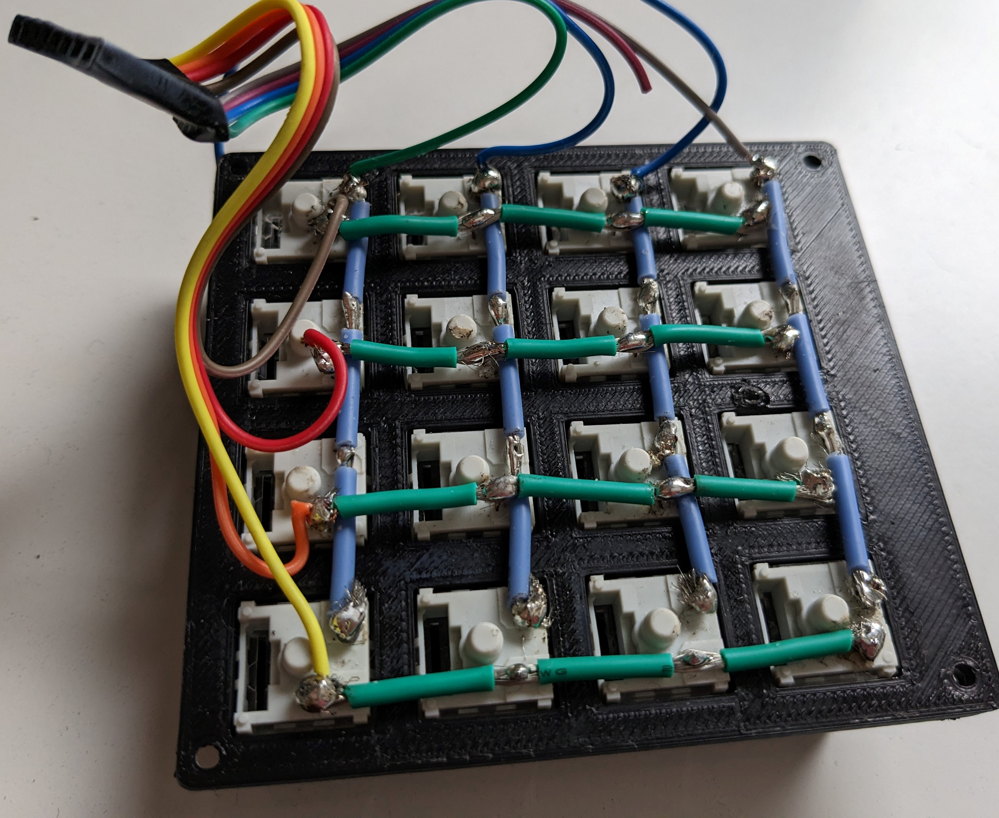
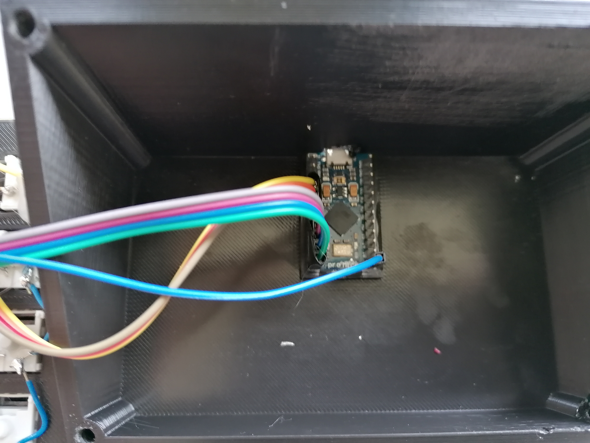

# Macro Keyboard

## Usage

This is the code, I use for my Macro Keyboard. I use this for switching scenes in OBS, for hotkeys in Discord, and much more.

## Function

The Macro Keyboard uses a 4x4 Key Matrix and the [Arduino Keyboard library](https://www.arduino.cc/reference/en/language/functions/usb/keyboard/). In my case, I set the first 8 Keys to F13 - F20 and the second half to SHIFT + F13 - SHIFT + F20. Works great for me, except you can not use the F13 - F24 Keys natively in Windows 10. But that does not bother me. 

## Code

Huge thanks to BaldEngineer for his blogpost on button matrices, without this one I would have spent a lot more time on that project. Go check him out [here](https://www.baldengineer.com/arduino-keyboard-matrix-tutorial.html).

## Case

As a case, I designed one in Fusion 360. Unfortunately over time my vision changed and in the design I still have sliders integrated, that are not even connected to the microcontroller as I really do not need them. In addition there were some Problems with the screwholes and positioning of the sliders. All in all, I will not put those parts out right now, because version 1.0 still has some major flaws.

## Showcase

This is the inside of the MacroKeyboard. It is a little messy and if I will build this again, I will go for a much smaller formfactor and smaller cables as well. As you can see, soldering is not my strong suit, therefore I reinforced the cables with hot glue. Also the potentiometers are not connected at all, as explained, I really do not need them right now and I will design another version without them some time in the future.

With the Arduino Pro Micro I use as the microcontroller

And then there is the finished product. As you can see, the Sliders are in place but not even connected, so have no function whatsoever.

## Future plans

- Redesign the whole case without the sliders and inset the screws used to connect the top to the bottom
- Use a cleaner and smaller design but keep the 30° angle
- Add one key that functions as a profile key, to set every key twice or three times
- Come up with a modular idea for labeling the buttons
- Maybe include diodes to allow for multi button presses

## Parts

- [Mechanical Gaming Keyboard Keys](https://www.amazon.de/gp/product/B086MQXQW7/ref=ppx_yo_dt_b_asin_title_o07_s00?ie=UTF8&psc=1)
- [Arduino Pro Micro Clone](https://www.amazon.de/gp/product/B07FXCTVQP/ref=ppx_yo_dt_b_asin_title_o01_s00?ie=UTF8&psc=1)
- Some Wires and everything you need for soldering