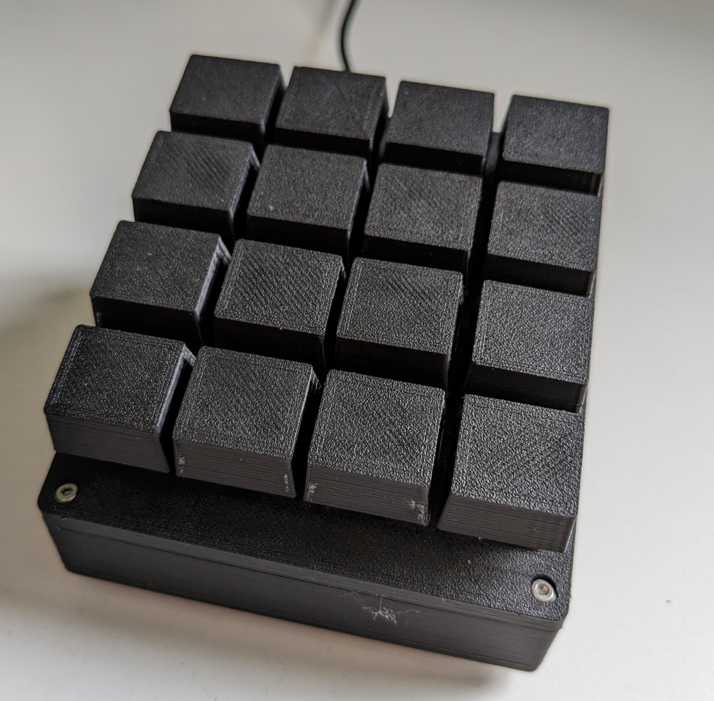

# Macro Keyboard

## Usage

This is the code I use for my Macro Keyboard. I use this for switching scenes in OBS, for hotkeys in Discord, and any macro I want basically.

## Function

The Macro Keyboard uses a 4x4 Key Matrix and the [Arduino Keyboard library](https://www.arduino.cc/reference/en/language/functions/usb/keyboard/). In my case, I set the first 8 Keys to F13 - F20 and the second half to SHIFT + F13 - SHIFT + F20. Works great for me, except you can not use the F13 - F24 Keys natively in Windows 10. If you don't need that functionality, you can use this code as is. But if you (like me) want to have even more possibilities with different configurations that you can switch and therefore endless possibilities on what your keyboard can do, check out my [MacroKeyboardHub](https://github.com/Spanching/MacroKeyboardHub).

## Code

Huge thanks to BaldEngineer for his blogpost on button matrices, without this one I would have spent a lot more time on that project. Go check it out [here](https://www.baldengineer.com/arduino-keyboard-matrix-tutorial.html).

In my case, the rows are connected to pins 9, 8, 7 and 6 and the columns are connected to 5, 4, 3, 2. There are no diodes between the keys, which means pressing multiple keys at once will not work correctly. 

## Case

For the case, I designed one in Fusion 360:

Solarized dark             |  Solarized Ocean
:-------------------------:|:-------------------------:
  |  
  |  

If you are interested in the stl files, check out this project on (Thingiverse)[https://www.thingiverse.com/thing:5987051].

The Arduino Pro Micro I used for this keyboard is glued in place in the base part of the keyboard and has a cutout for a micro usb cable to connect to a PC:

As you can see, there are four M2*12 screws that hold the Keyboard together in the corners.

## Showcase

This is the button matrix of the MacroKeyboard. I am not the best when it comes to soldering, but I am pretty proud of this one. If you look closely, you can see that the purple wire is not connected in my case, because it did not work. So I just cut it off and used another single blue wire to connect to the second line from the right.

Finished Button Matrix          |  Opened Macro Keyboard
:-------------------------:|:-------------------------:
  |  

## Future plans

- Come up with a modular idea for labeling the buttons
- Maybe include diodes to allow for multi button presses

## Parts

These are the products I bought with the respective links, but you can of course use other things as well. Especially for the screws, you might not need such a big set.

- [Mechanical Gaming Keyboard Keys](https://www.amazon.de/gp/product/B086MQXQW7/ref=ppx_yo_dt_b_asin_title_o07_s00?ie=UTF8&psc=1)
- [Arduino Pro Micro Clone](https://www.amazon.de/gp/product/B07FXCTVQP/ref=ppx_yo_dt_b_asin_title_o01_s00?ie=UTF8&psc=1)
- [M2*12 screws (set)](https://www.amazon.de/Edelstahl-Sechskopf-Knopf-Schrauben-Unterlegscheiben-Sortiment-Aufbewahrung/dp/B073SS7D8J/ref=sr_1_26?keywords=m2*12&qid=1682267986&sr=8-26)
- Some Wires and everything you need for soldering